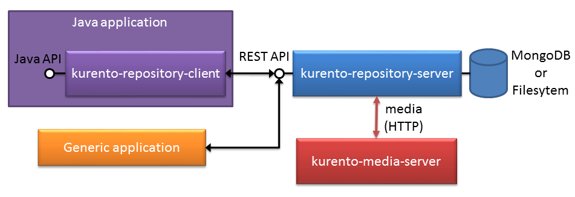

.. image:: images/kurento-rect-logo3.png
   :alt:    Kurento logo
   :align:  center

Introduction
============

Welcome to the **Kurento Repository** project. This piece of software is part of
`Kurento <http://www.kurento.org/>`_, and it allows to manage media
repositories based on the storage capabilities provided by a file system or an
instance of :term:`MongoDB`. The following picture illustrates the architecture
of the Kurento Repository:

   *Kurento Repository Architecture*

As it can be seen, the Kurento Repository has been designed following a
client-server architecture. Therefore, it has two main components:

* **kurento-repository-server** : Stand-alone application which implements a
  media repository, exposing its capabilities through an easy-to-use
  :term:`HTTP` :term:`REST` API. It has been implement as a :term:`Spring Boot`
  application.

* **kurento-repository-client** : Java library that wraps the REST
  communication with the server, exposing a Java API which can be consumed in
  Java applications.

In short, the *kurento-repository-server* allows media recording and playing.
These capabilities can be consumed by any application by means of the REST API,
of specifically by Java application using the *kurento-repository-client*. The
media in the repository can be consumed by *kurento-media-server* using HTTP as
transport.

Example
-------

There is a Kurento Java
`tutorial application <https://github.com/Kurento/kurento-tutorial-java/tree/master/kurento-hello-world-repository>`_
that connects to a running instance of the **kurento-repository-server** to
record and play media over HTTP using the capabilities of the
`Kurento Media Server <http://www.kurento.org>`_.

Source code
-----------

Kurento Repository is open source (Apache 2.0) and it is hosted on
`GitHub <https://github.com/Kurento/kurento-java/tree/master/kurento-repository>`_.
This Git repository contains a Maven project with the following modules:

* *kurento-java*: Reactor project.
* *kurento-repository-server*: Contains a Spring Boot application, very easy
  to setup and run. It exposes the HTTP REST API
* *kurento-repository-client*:  Wrapper for the library, offering a simpler
  Java API.
* *kurento-repository-internal*: core Java library of repository. Plain Java
  mostly, but with Spring dependencies.

Content of this documentation
-----------------------------

In order to learn how to build, configure and run the server application, please
refer to the :doc:`Repository Server <repository_server>` section. The
:doc:`REST API <repository_rest_api>` that can be used to communicate with the
server are described in the next section. The Java API is depicted on the
section :doc:`repository client <repository_client>`. The complete
:doc:`JavaDoc <repository_javadoc>` reference is also provided. Finally, a
reference of the most important terms handled in this documentation is
summarized in the :doc:`glossary <glossary>` section.
